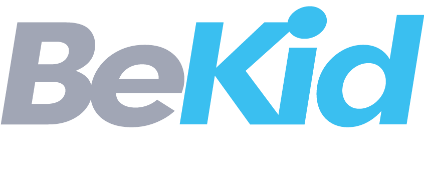
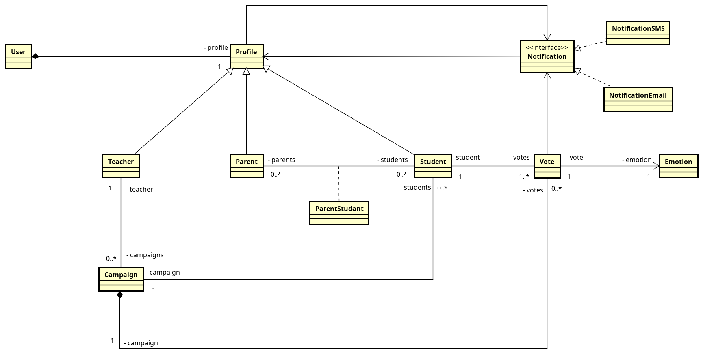

# BeKid

[](https://github.com/venzel/bekid/blob/master/LICENSE)

> **BeKid** é uma aplicação para o mapeamento de emoções e combate ao bullying escolar.<br /> <a href="http://bekid.app">👉 bekid.app</a>

<p align="center"></p>

## Tecnologias

API Rest em **Typescript** e **NodeJS** com uma arquitetura **Feature by Package** (módulos e casos de usos).

<p align="left">
     
     
</p>

### Back end

-   Typescript
-   NodeJS / Express / Jest / TypeORM

### Persistência de dados

-   Postgres / MongoDB / Redis

### Outras informações

O projeto tem como gerencimento de pacotes o **Yarn** e o **Makefile** como automação de comandos, além disso, o Postgres, MongoDB e Redis são containers do **Docker**.

## Arquitetura

### Porque Feature by Package?

Feature by Package (FBP) é uma arquitetura que utiliza conceitos do **DDD (Domain Driven Design)**, sugerida por empresas como a **Rocketseat**, com o objetivo de tornar o código mais **flexível**, **escalável** e de **manutenção simples**.

### Vantagens da arquitetura

-   **MANUTENÇÃO**: Facilita o engajamento de muitas equipe e colaboradores em um projeto;
-   **ESCALÁVEL**: Facilita refatoramento do código monolítico para uma uma estrura de microserviços;
-   **SOLID**: Facilita a aplicação de todos os princípios do SOLID;
-   **GIT**: Melhora o gerenciamento dos commits, evitando conflitos e etc;
-   **TESTES**: Facilita o desenvolvimento de testes de unidade e integração.

### Organização das pastas

<p align="center"></p>

## Diagrama

### Versão 1



### Influências

Este projeto tem como principais influências, os fundamentos da <a href="https://rocketseat.com.br">Rocketseat</a>, <a href="https://devsuperior.com.br">DevSuperior<a> e <a href="https://www.algaworks.com">AlgaWorks<a>.

## Como executar o projeto

### Pré-requisitos

-   Node.js nas versoes acima da 14.5.0
-   Docker
-   Docker compose

```bash
# Para clonar repositório
git clone https://github.com/venzel/bekid

# Para entrar na pasta do projeto
cd bekid

# Para subir o containers
make up

# Para executar o projeto na porta 8080
make run
```

## Autor

Enéas Almeida

<a href="https://www.linkedin.com/in/venzel">https://www.linkedin.com/in/venzel</a>
